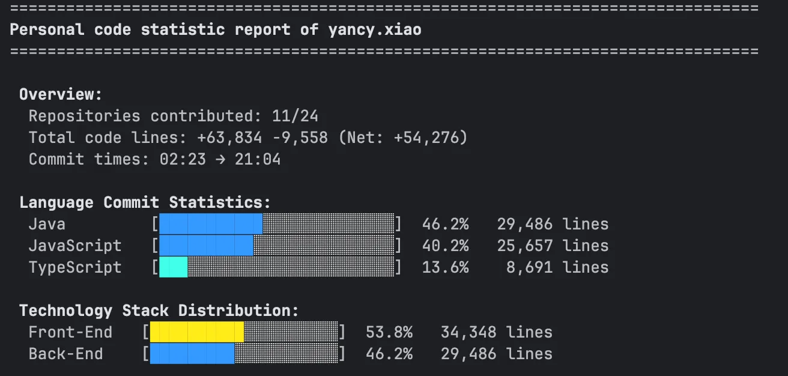

# Git代码提交行数统计工具

命令行工具，用于统计Git仓库中的代码提交行数。  
目前仅在mac上成功运行(因为我的设备是mac)  
如果你希望让它支持Windows/Linux，你可以修改代码中具体执行的扫盘命令...

## 为什么需要它
  使用柱状图来可视化自己的代码commit，这难道不是一件很酷的事情么！  
  
让牛马能精准的意识到自己拉了多少磨(bushi)

## 功能

- 系统级扫描：自动发现并统计系统中的所有Git项目
- 个人统计：查询个人在所有项目中的代码贡献
- 语言分类：自动识别编程语言并分类
- 并行处理：多线程快速分析大量仓库
- 灵活过滤：支持按作者、日期、语言过滤
- JSON导出：支持数据导出


## 使用效果

## 安装

```bash
git clone https://github.com/Asthenia0412/GitStats.git
cd git-stats
pip install -r requirements.txt
```

## 使用

### 基本用法

```bash
# 分析当前仓库
python3 git_stats.py

# 分析指定仓库
python3 git_stats.py -p /path/to/repo
```

### 个人统计

```bash
# 交互式统计
python3 git_stats.py -i

# 指定用户统计
python3 git_stats.py --personal "username"
```

### 系统扫描

```bash
# 扫描整个系统
python3 git_stats.py --system

# 扫描并显示Top 10
python3 git_stats.py --system -t 10
```

### 过滤选项

```bash
# 按作者过滤
python3 git_stats.py -a "author"

# 按时间范围过滤
python3 git_stats.py -s "2023-01-01" -u "2023-12-31"

# 导出JSON
python3 git_stats.py -o stats.json
```

## 输出示例

```
用户 john.doe 的代码统计报告
================================

贡献时间: 2022-03-15 → 2024-09-27
贡献仓库: 15/127
代码行数: +89,456 -12,345 (净: +77,111)

语言分布:
Python       [██████████████░░] 89.2%  45,678 行
JavaScript   [████░░░░░░░░░░░░]  7.8%   3,456 行
TypeScript   [██░░░░░░░░░░░░░░]  2.1%   1,234 行

最活跃仓库:
1. data-processing: 23,456 行
2. web-scraper: 12,345 行
3. api-server: 8,901 行
```

## 配置

工具会自动过滤非代码文件，包括：
- 配置文件（package.json, .config等）
- 文档文件（README, LICENSE等）
- 资源文件（图片、日志等）

只统计真正的代码文件：Python、JavaScript、Java、Go等编程语言文件。

## 许可证

MIT License